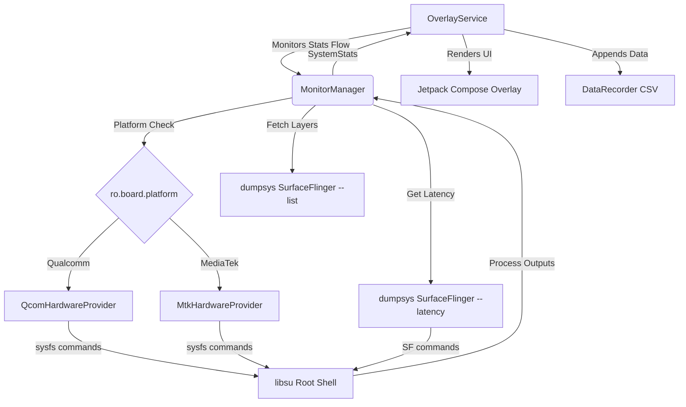
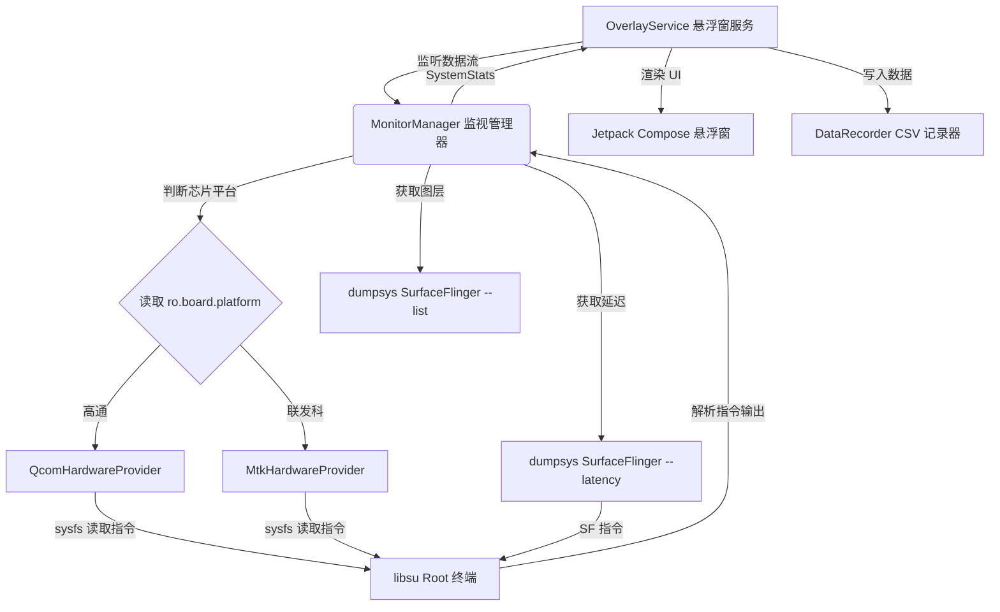

# SeriaHud

An overlay for temperatures, CPU/GPU load, FPS, and more on Android devices.
适用于 Android 设备的温度、CPU/GPU 负载、FPS 及更多信息的系统性能悬浮窗。

---

## Language / 语言
- [English](#english)
- [简体中文](#简体中文)

---

<a name="english"></a>
# English

`SeriaHud` is a lightweight, high-performance overlay monitor for Android devices. Written in Kotlin using **Jetpack Compose**, it leverages root access to fetch real-time hardware statistics directly from sysfs and SurfaceFlinger latency metrics, displaying them in a sleek, customizable floating window.

> [!IMPORTANT]
> **Root access** is required to query low-level hardware nodes (e.g., CPU/GPU frequencies, SoC temperatures) and profile rendering performance.
> **Display over other apps** (overlay permission) is required to show the floating monitor.

## Key Features

*   **Accurate FPS & Frametime Monitoring**: Retrieves rendering timestamps directly from SurfaceFlinger for the active window, calculating precise FPS and frametimes (ms) with improved per-layer tracking logic.
*   **Dynamic Platform GPU Detection**:
    *   **Qualcomm Snapdragon**: Tracks GPU usage and frequencies from `kgsl-3d0`.
    *   **MediaTek Dimensity**: Tracks GPU usage and frequencies through `ged` drivers.
*   **Granular CPU Core Tracking**: Displays overall CPU usage alongside frequencies of individual selected cores.
*   **Thermal Monitoring & Battery Power**: Displays real-time SoC temperature, battery temperature, and power draw, with support for dual-cell battery compensation.
*   **Hardware Diagnostics**: Built-in hardware detection UI to diagnose and view system capabilities.
*   **Real-time Performance Graphs**: Shows a live 60-frame historical frametime graph to help diagnose stuttering.
*   **Stable Data Sampling**: Implemented data interpolation, filtering, and latching mechanisms to ensure stable readings and prevent erroneous zero-value flickering.
*   **CSV Performance Logging & Analysis**: Easily record performance logs by tapping the record button. Logs are saved in CSV format and can be renamed or analyzed directly within the app using the built-in Chart page. Default path:
    `/Android/data/org.chtholly.seriahud/files/records/record_YYYYMMDD_HHMMSS.csv`

---

## How it Works



1.  **Platform Detection**: On launch, the app runs `getprop ro.board.platform` to determine whether the device runs on a Qualcomm or MediaTek chipset, choosing the appropriate hardware provider.
2.  **Sysfs Queries**: Reads hardware states via root shell commands (e.g. `/proc/stat`, `/proc/meminfo`, `/sys/class/power_supply/battery`, and `/sys/class/kgsl`).
3.  **Active Window Detection**: Polls `dumpsys window | grep mCurrentFocus` to identify the current foreground application package and its corresponding SurfaceFlinger layers.
4.  **FPS Calculation**: Runs `dumpsys SurfaceFlinger --latency` on the detected layers, parses frame timestamps, and computes average latency and frame rate.
5.  **Overlay Rendering**: Draws the user interface using a Jetpack Compose overlay layout wrapped in a WindowManager `ComposeView`.

---

## CSV Log Columns

When recording is active, the app logs the following metrics at 500ms intervals:

| Column | Unit | Description |
| :--- | :--- | :--- |
| `Time` | `HH:mm:ss.SSS` | Local timestamp of the recorded sample |
| `FPS` | `fps` | Frames per second calculated from SurfaceFlinger |
| `Frametime_ms` | `ms` | The average time taken to render a frame |
| `CPU_Usage_Pct`| `%` | Overall CPU utilization percentage |
| `GPU_Usage_Pct`| `%` | GPU core load percentage |
| `GPU_Freq_MHz` | `MHz` | Current GPU clock frequency |
| `SoC_Temp_C`   | `°C` | Core chipset temperature |
| `Battery_Power_W`| `W` | Real-time battery power draw (current × voltage) |
| `RAM_Usage_Pct`| `%` | Memory utilization percentage |

---

## Build & Development

### Requirements
- Android SDK 36 (targetSdk)
- JDK 17
- Android Gradle Plugin

To build the debug APK from the command line, run:
```bash
./gradlew assembleDebug
```

---

<br/>

<a name="简体中文"></a>
# 简体中文

`SeriaHud` 是一款专为 Android 设备设计的轻量级、高性能系统性能监视悬浮窗。项目基于 **Jetpack Compose** 和 Kotlin 开发，利用 Root 权限直接读取系统的 sysfs 节点和 SurfaceFlinger 渲染管线数据，以精致、高度可配置的悬浮窗形式呈现。

> [!IMPORTANT]
> **需要 Root 权限**：用于访问低级硬件接口（如 CPU/GPU 频率、SoC 温度节点）以及获取高精度渲染时间。
> **悬浮窗权限**（显示在其他应用上）：用于在屏幕上展现监视浮窗。

## 核心功能

*   **高精度 FPS 与帧时间（Frametime）**：直接从系统 SurfaceFlinger 读取活跃窗口的渲染时间戳，计算精准 FPS 和 Frametime（ms），并改进了按图层追踪的解析逻辑。
*   **主流 GPU 平台动态适配**：
    *   **高通骁龙 (Qualcomm)**：自动查找并监测 `kgsl-3d0` 相关的 GPU 占用率与频率。
    *   **联发科天玑 (MediaTek)**：通过内置的 `ged` 驱动参数查询 GPU 负载及频率。
*   **细粒度 CPU 核心监测**：除了整体 CPU 占用率，还可在设置中指定监视并显示特定 CPU 核心的运行频率。
*   **发热监控与功耗**：实时获取 SoC 温度、电池温度及功耗，并支持双电芯电池功耗补偿。
*   **硬件诊断**：内置硬件检测 UI，方便诊断和查看系统硬件功能支持情况。
*   **实时性能折线图**：内置最近 60 帧的实时帧时间（Frametime）波动曲线，卡顿掉帧一目了然。
*   **数据采样稳定性**：实现了数据插值、滤波与锁存机制，确保数据读取的稳定性，防止错误的“零值”闪烁。
*   **CSV 性能日志记录与分析**：点击悬浮窗侧边记录按钮即可开启后台性能记录。生成的 CSV 日志可以在应用内直接重命名或通过内置的图表页面进行可视化分析。默认保存在：
    `/Android/data/org.chtholly.seriahud/files/records/record_年份日期_时间.csv`

---

## 技术原理



1.  **芯片识别**：应用启动时运行 `getprop ro.board.platform` 获取芯片代号，动态匹配并实例化 Qcom 或 Mtk 硬件提供者。
2.  **底层查询**：基于 Root 权限，通过 `libsu` 执行底层 shell 命令，读取 `/proc/stat`、`/proc/meminfo` 以及特定硬件路径。
3.  **活跃图层定位**：定时轮询 `dumpsys window | grep mCurrentFocus` 获取当前前台应用包名，并在 `SurfaceFlinger` 中过滤出其渲染主图层。
4.  **帧率计算**：针对主图层执行 `dumpsys SurfaceFlinger --latency`，解析最新产生的渲染帧时间戳，计算瞬时 FPS 和 Frametime。
5.  **悬浮窗展示**：通过 `OverlayService`（继承自 `LifecycleService`）利用 WindowManager 在桌面上添加 `ComposeView`，实现悬浮窗界面的实时刷新。

---

## CSV 性能日志列说明

开启数据记录后，应用以 500 毫秒为间隔向日志追加以下字段：

| 数据列 | 单位 | 描述 |
| :--- | :--- | :--- |
| `Time` | `HH:mm:ss.SSS` | 记录生成时的本地时间戳 |
| `FPS` | `fps` | 从 SurfaceFlinger 计算出的实时帧率 |
| `Frametime_ms` | `ms` | 渲染帧所需的平均时长 |
| `CPU_Usage_Pct`| `%` | 整体 CPU 占用率 |
| `GPU_Usage_Pct`| `%` | GPU 核心负载百分比 |
| `GPU_Freq_MHz` | `MHz` | GPU 实时运行频率 |
| `SoC_Temp_C`   | `°C` | 芯片核心温度 |
| `Battery_Power_W`| `W` | 实时电池消耗功率（电压 × 电流） |
| `RAM_Usage_Pct`| `%` | 系统内存占用率 |

---

## 编译与开发

### 环境要求
- Android SDK 36 (targetSdk)
- JDK 17
- Android Gradle Plugin (AGP)

在命令行中直接编译 debug APK：
```bash
./gradlew assembleDebug
```
